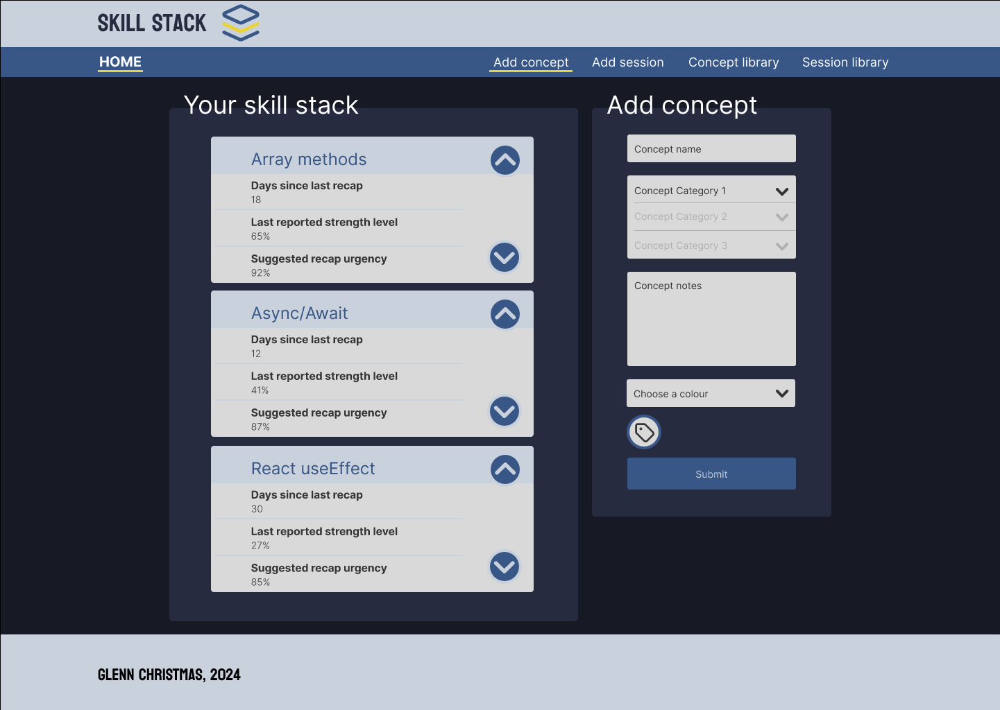
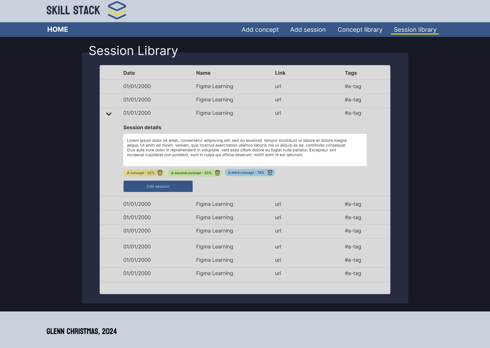

# Welcome to Skill Stack

This is my second React project to reinforce recent learning. This time I want to build something a little more complex that I can make some real use of in future.

## Why Skill Stack?

A recommendation often made when learning to program is to build products that solve genuine problems. So, here is one of mine: A big hurdle I've faced while learning is keeping track of the enormity of tools and techniques I need to get my head around to eventually become a full-stack developer. For example, I've been learning JS fundamentals, NodeJS on the back end, React on the front end, some web design, testing, code cleanliness/modularity, version control, CI/CD, etc.

As I'm juggling this with a full-time data analyst job (using R/SQL rather than JS), I've read a few books (e.g. [The Programmer's Brain](https://www.manning.com/books/the-programmers-brain) and [A Mind for Numbers](https://www.goodreads.com/book/show/18693655-a-mind-for-numbers)) on the topic of efficient skill acquisition. This is something I've always struggled with as my habit is to work intensely in short bursts, feeling like I've learned a great deal, only to struggle recalling any of it a few months later.

One of the crucial practices recommended in these books is to differentiate short and long term memory, and that the goal of effective learning should be to shift concepts from short term into the long term memory. The way they recommend to do this is via spaced repetition. This felt like a bit of a blow to the way I'd been approaching learning, but I gave it a go, studying for an hour or so a day before work instead of cramming, and was amazed at how much concepts that I'd initially struggled with were now fitting together. As an example: once I'd used spaced repetition to get comfortable with the concept of callback functions, nailing down Array methods was much simpler than I'd expected.

Being obsessed with optimisation (not an unhelpful trait for an analyst!), I want to take this a step further and ensure I'm making use of spaced learning as effectively as possible while I continue to expand my knowledge. Hence, Skill Stack.

## What is it?

This app will display a stack of concepts with recommendations for concepts to recap based on when I last used the concept (e.g. during study or app building), and how deep I felt my understanding of that concept was at the time. The recommendations will emphasise more frequent recaps for newly-acquired concepts with lower understanding, and fewer (but, crucially, not _none_) recaps of long-standing, high-confidence concepts. The problem the app solves is to remove the guesswork and get that balance right.

## What will the user be able to do?

The user will be able to log one of two things:

- A concept - A piece of knowledge the user has acquired via study or as a byproduct of developing code. The user will be able to supply notes, tags, and select a category from a nesting of multiple layers of specificity.
- A session - A study or development session, in which the user can log which concepts from their concepts library they have studied/practiced, alongside their respective confidence levels with each respective concept.

I will also be looking to add mechanisms to allow users to retrospectively edit concepts and sessions.

## What will the app do for the user?

The app will use session and concept data to update respective libraries (see an example below) for concepts and sessions. Information from these libraries will be used to generate a skill stack that spans across all concepts the user has supplied.

The skill stack (see image above) will be ordered by a suggested recap urgency rating (see 'What is it' above for more information). However, the user will also have the ability to amend this ordering should they wish.

## When will this be available?

I'm not sure! I've realised this is a bit more of a challenge than my last app (e.g. it's now at a scale where I've drawn out diagrams, am considering data structures in advance, have built rough visual designs for components in Figma, etc), so it may take some time to build. I'm also likely to be dipping in and out of work on it as I build/reinforce knowledge from my ongoing learning.

Hopefully soon!
